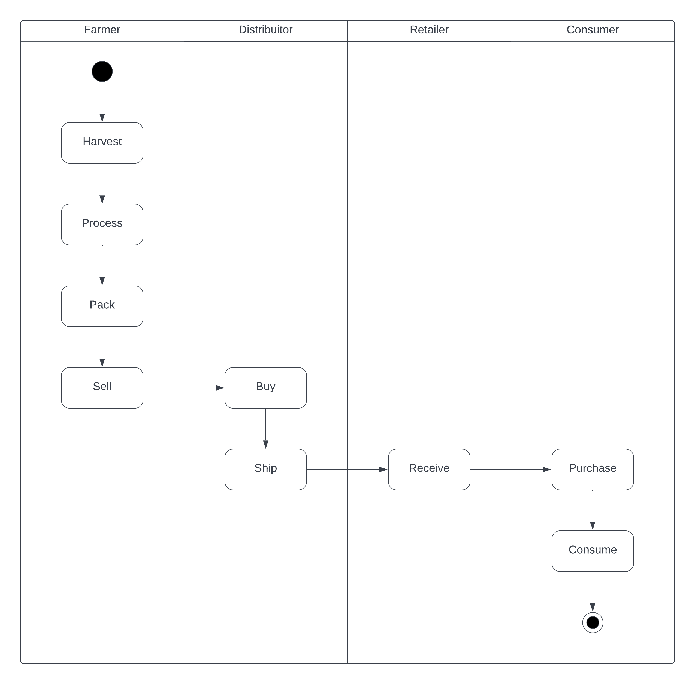
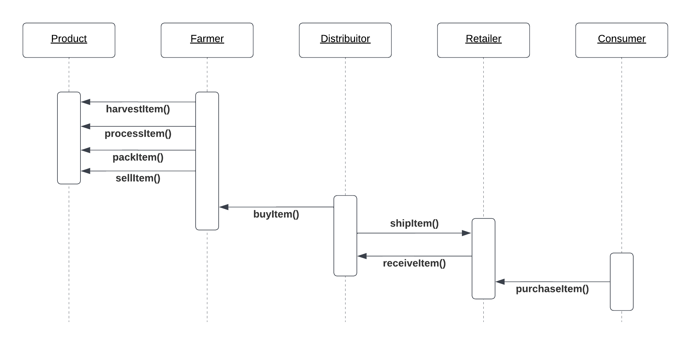
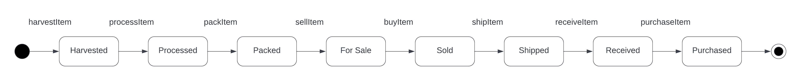
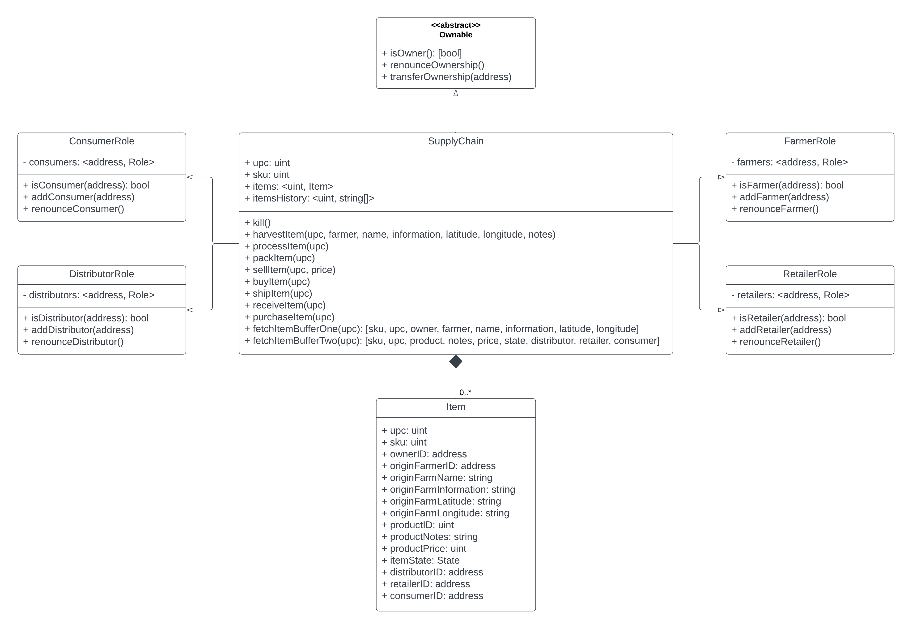
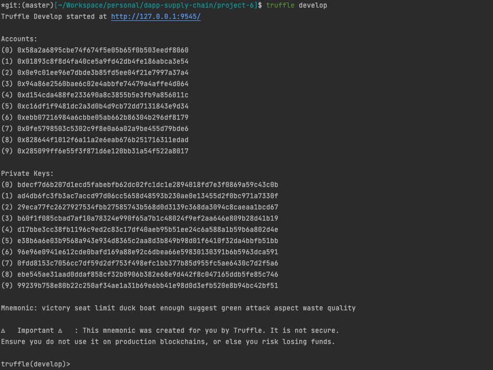
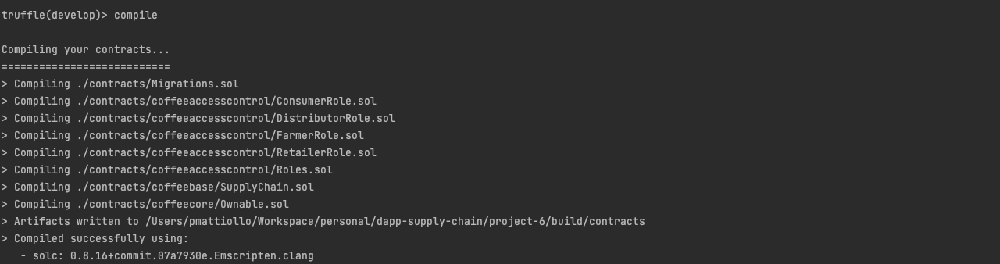
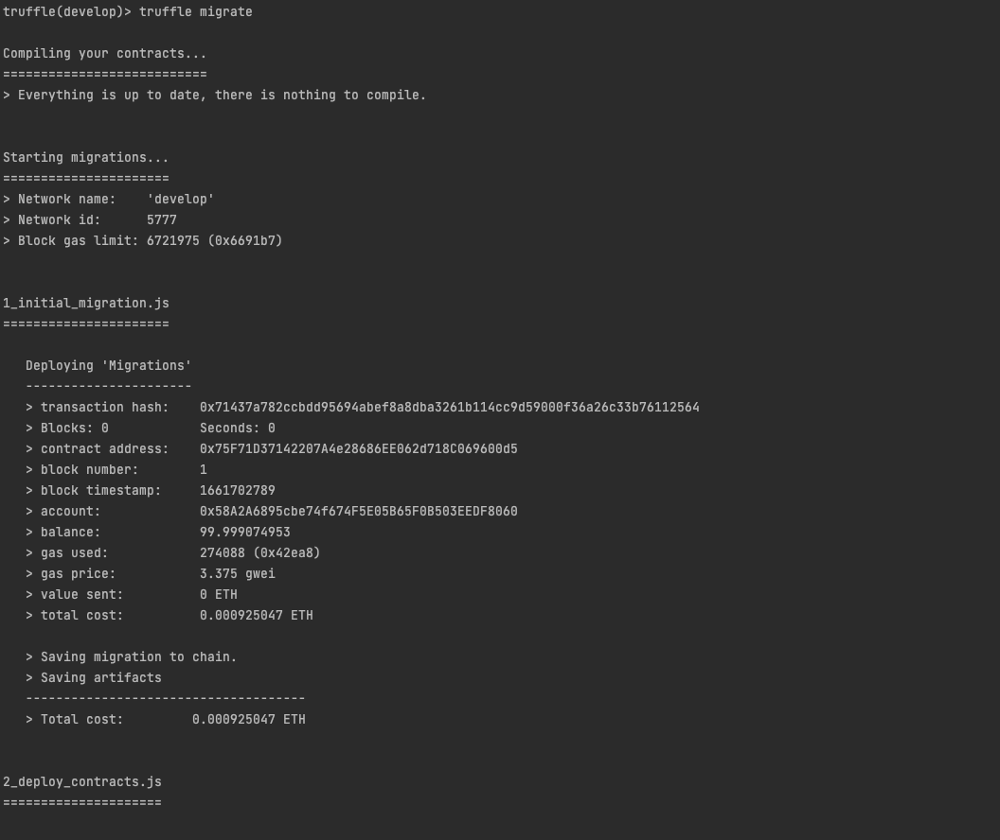
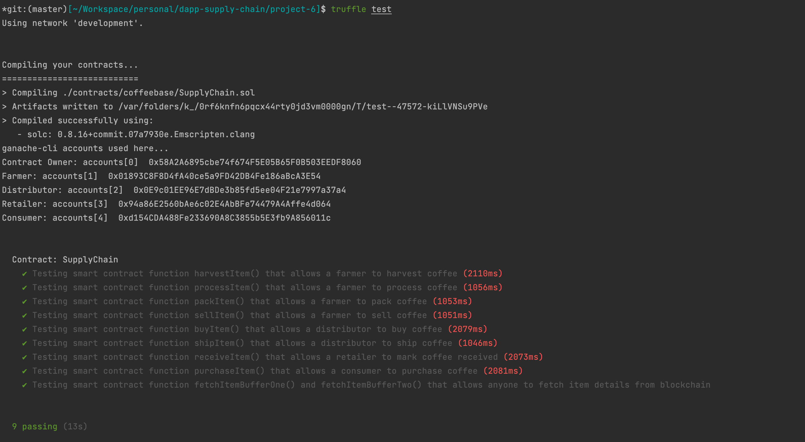

# Supply chain & data auditing

This repository containts an Ethereum DApp that demonstrates a Supply Chain flow between a Seller and Buyer. The user story is similar to any commonly used supply chain process. A Seller can add items to the inventory system stored in the blockchain. A Buyer can purchase such items from the inventory system. Additionally a Seller can mark an item as Shipped, and similarly a Buyer can mark an item as Received.

The DApp User Interface when running should look like...


## Deployed contract
The current contracts were deployed to Rinkeby. The main contract of the SuplyChain and can be view under the address [0xeA4a6eacDd2840B77fA1C0B34652Aa503C210579](https://rinkeby.etherscan.io/address/0xeA4a6eacDd2840B77fA1C0B34652Aa503C210579#code).

## Illustrations
Some illustrations to add more information about the Supply Chain DApp.





## Getting Started

These instructions will get you a copy of the project up and running on your local machine for development and testing purposes. See deployment for notes on how to deploy the project on a live system.

### Prerequisites

Please make sure you've already installed ganache-cli (or ui) on port 7545, Truffle and enabled MetaMask extension in your browser.

```
truffle version
```

### Installing

> The starter code is written for **Solidity v0.8.15**, or greater. Please refer to Solidity [documentation](https://docs.soliditylang.org/en/v0.5.0/050-breaking-changes.html) for more details and check all the breaking changes. To use this starter code, please run `npm i -g truffle@5.5.23` to install Truffle v5 with Solidity v0.5.16. 

A step by step series of examples that tell you have to get a development env running

Clone this repository:

```
git clone https://github.com/pmattiollo/dapp-supply-chain.git
```

Change directory to ```project-6``` folder and install all requisite npm packages (as listed in ```package.json```):

```
cd project-6
npm install
```

Start truffle in development mode:

```
truffle develop
```

Your terminal should look something like this:



Yet in the development mode, compile the contracts with truffle:

```
compile
```

Your terminal should look something like this:



This will create the smart contract artifacts in folder ```build\contracts```.

Yet in the development mode, migrate smart contracts to the locally running blockchain, truffle:

```
migrate
```

Your terminal should look something like this:



Yet in the development mode, test smart contracts:

```
test
```

All 9 tests should pass.



In a separate terminal window, launch the DApp:

```
npm run dev
```

## Built With

* [Ethereum](https://www.ethereum.org/) - Ethereum is a decentralized platform that runs smart contracts
* [Truffle Framework](http://truffleframework.com/) - Truffle is the most popular development framework for Ethereum with a mission to make your life a whole lot easier.


## Authors

See also the list of [contributors](https://github.com/your/project/contributors.md) who participated in this project.

## Acknowledgments

* Solidity
* Ganache-cli
* Truffle
* IPFS
